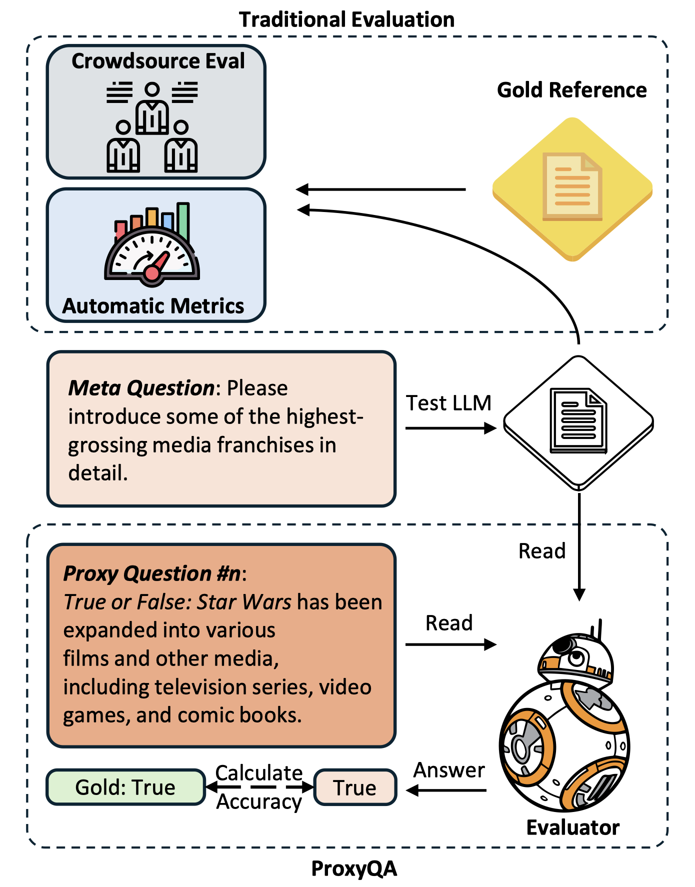

# Readme

## 💡 The official Repo of the paper [PROXYQA: An Alternative Framework for Evaluating Long-Form Text Generation with Large Language Models](https://arxiv.org/abs/2401.15042) 


---



## Getting Started

Clone the repo with command:

```bash
git clone https://github.com/Namco0816/ProxyQA.git
```

Loading the proxy-qa with [🤗 Datasets](https://huggingface.co/docs/datasets):

```python
from datasets import load_from_disk
proxy_qa = load_from_disk('proxy_qa')
print(proxy_qa)

# Dataset({
#    features: ['meta_question', 'wiki_cover', 'time_sensitive', 'id', 'domain'],
#    num_rows: 100
#})
```

The distribution of the covered domain


The leaderboard will be available at [proxy-qa](proxy-qa.com), currently it is still work in progress.